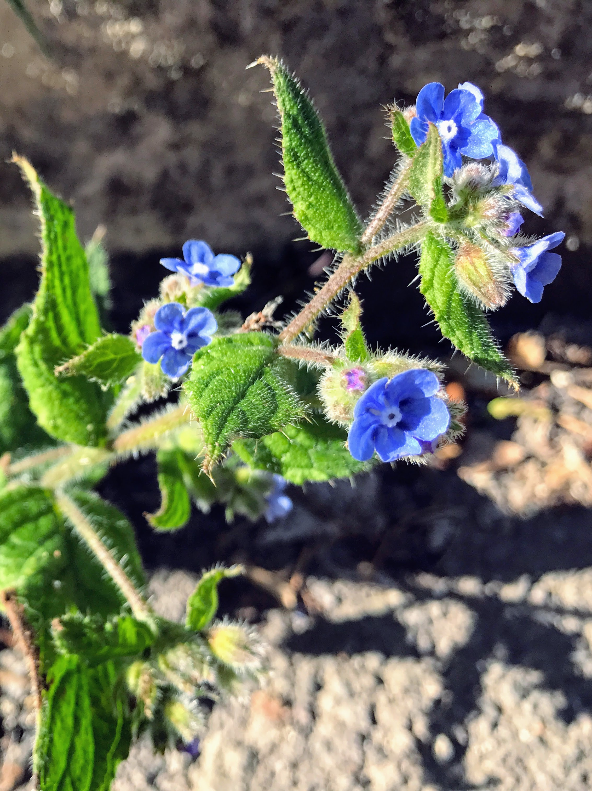

# Alkanet

"In alkali environments the alkanet dye has a blue color, with the color
changing again to crimson on addition of an acid. The colour is red at pH
6.1, purple at 8.8 and blue at pH 10."

- [Alkanna tinctoria](https://en.wikipedia.org/wiki/Alkanna_tinctoria)
- [Pentaglottis sempervirens](https://en.wikipedia.org/wiki/Pentaglottis_sempervirens)

