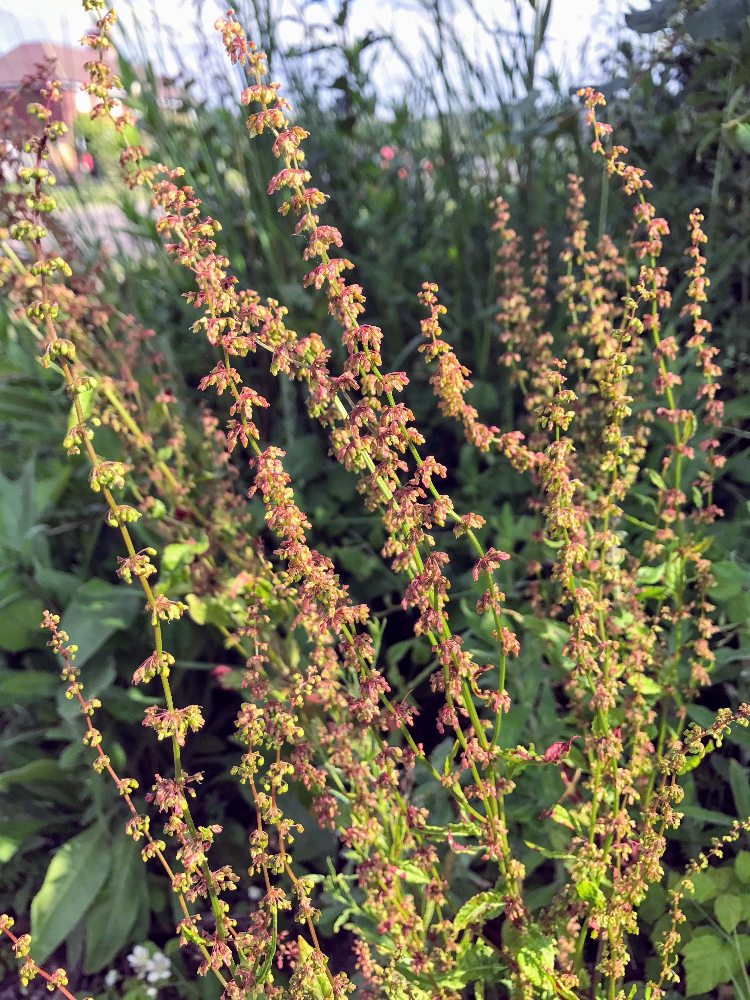
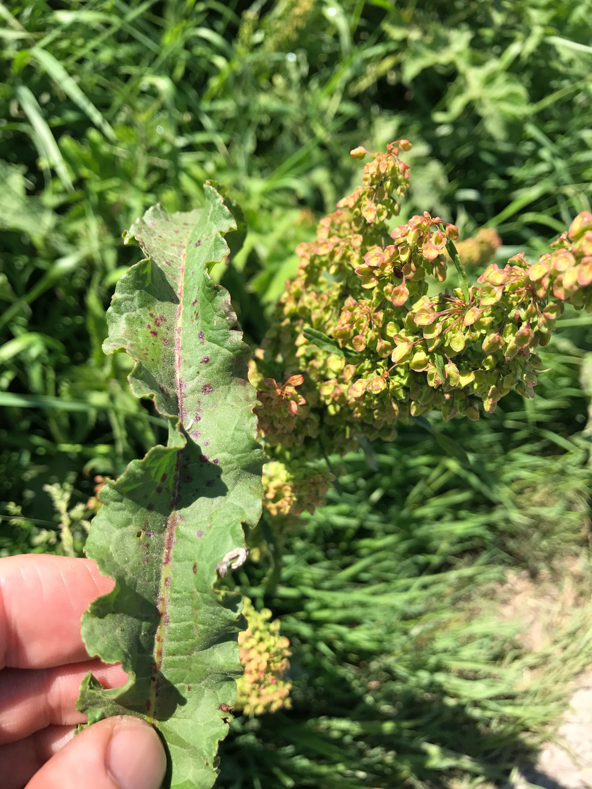
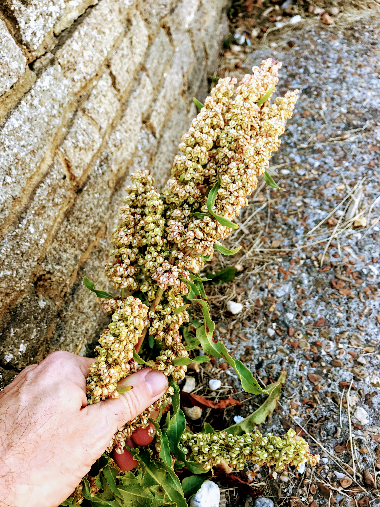
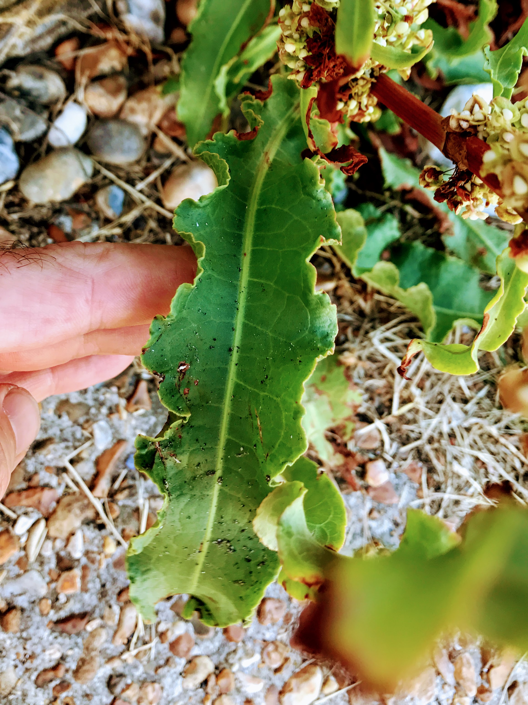

# Rumex sp.

There are so many species of [Rumex](https://en.wikipedia.org/wiki/Rumex).

- Curled dock (Rumex crispus)
- Rumex obtusifolius
- [Rumex acetosella](https://en.wikipedia.org/wiki/Rumex_acetosella)

## Littoral variety

