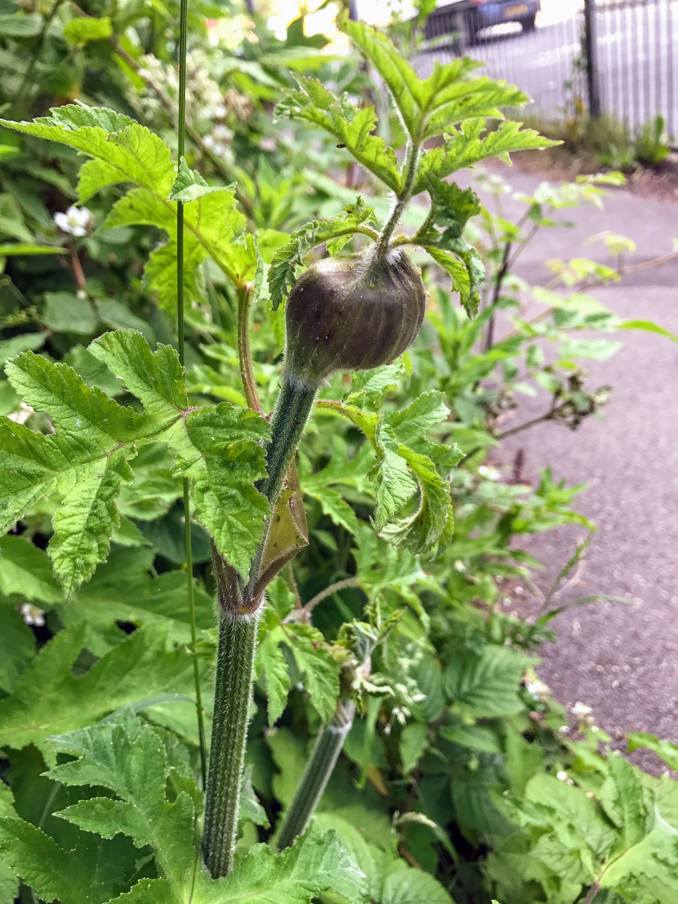
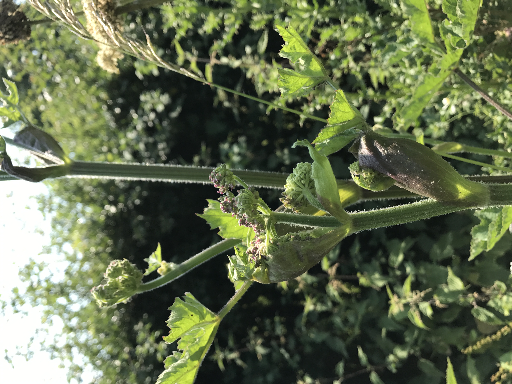

# Hogweed

This was actually found in Crawley, will replace with a Brighton specimen.

- [Heracleum sphondylium](https://en.wikipedia.org/wiki/Heracleum_sphondylium)
- http://www.wildfooduk.com/articles/giant-hogweed-and-common-hogweed/

