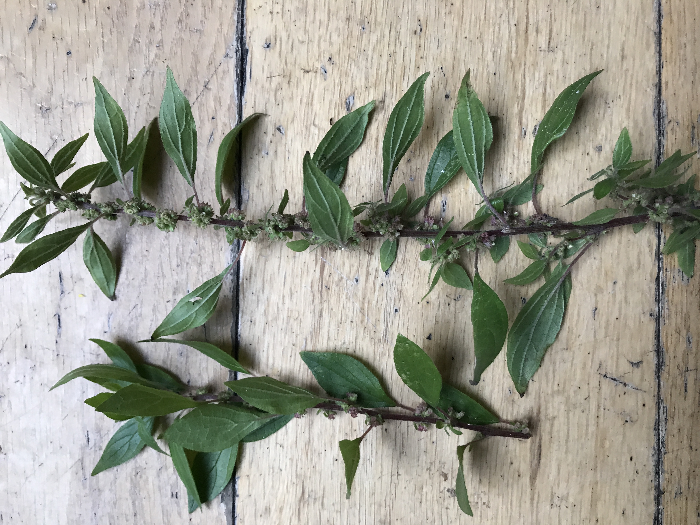
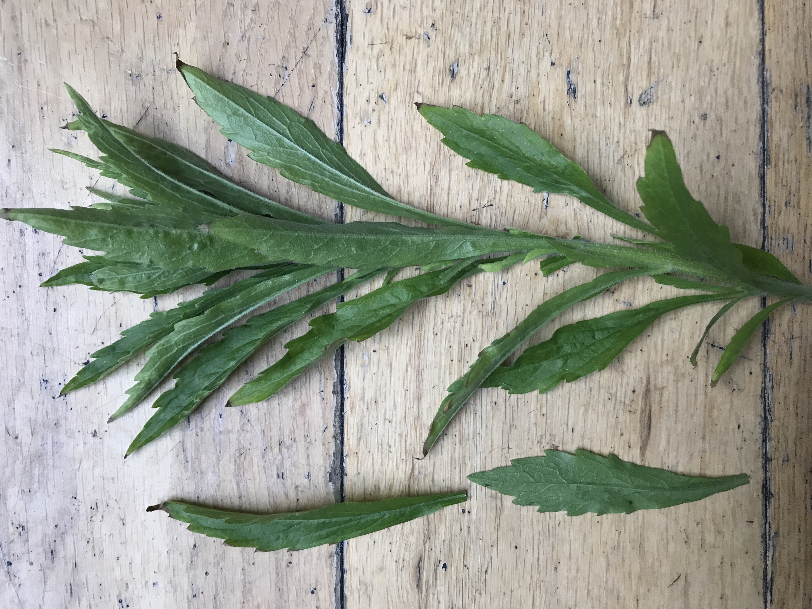
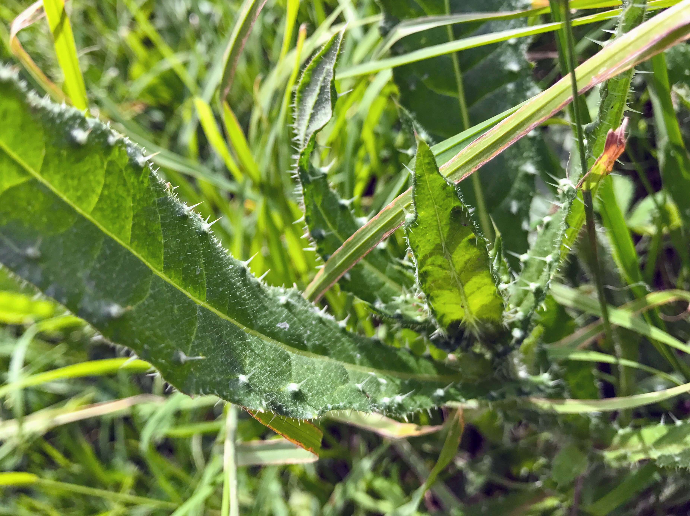
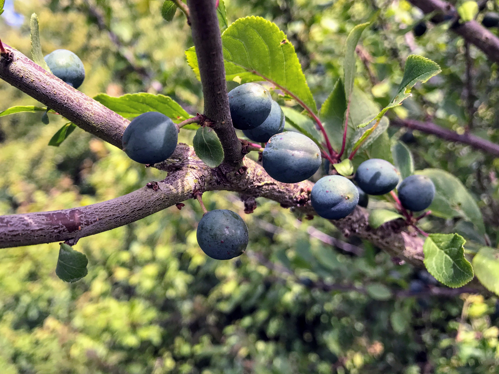
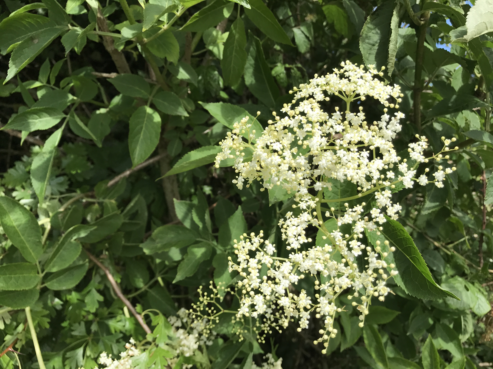
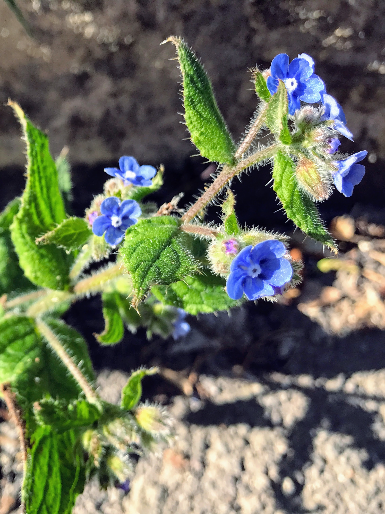

- [Meadowsweet](meadowsweet.md)
- [Sea Kale](seakale.md)
- [Hogweed](hogweed.md)
- [Mint](mint.md)
- [Yellow wort](yellowwort/readme.md)
- [Mustard](mustard.md)
- [Willowherb](willowherb/readme.md)
- [Sea veg](seaveg/readme.md)
- [Mallow](mallow/readme.md)
- [Bramble](bramble/readme.md)

# Parietaria judaica

See [Parietaria judaica](https://en.wikipedia.org/wiki/Parietaria_judaica).

# Erigeron canadensis

See [Erigeron canadensis](https://en.wikipedia.org/wiki/Erigeron_canadensis).

# Bristly ox tongue

See [Helminthotheca echioides](https://en.wikipedia.org/wiki/Helminthotheca_echioides).

# Black horehound (Ballota nigra subsp. meridionalis)?

# Alder buckthorn | damson | bullace | sloe (too early)

# Elderflower

See [Sambucus](https://en.wikipedia.org/wiki/Sambucus).

# Alkanet

"In alkali environments the alkanet dye has a blue color, with the color
changing again to crimson on addition of an acid. The colour is red at pH
6.1, purple at 8.8 and blue at pH 10."

- [Alkanna tinctoria](https://en.wikipedia.org/wiki/Alkanna_tinctoria)
- [Pentaglottis sempervirens](https://en.wikipedia.org/wiki/Pentaglottis_sempervirens)

# Things I'd like to find

- Wood sorrel ([Oxalis](https://en.wikipedia.org/wiki/Oxalis))
