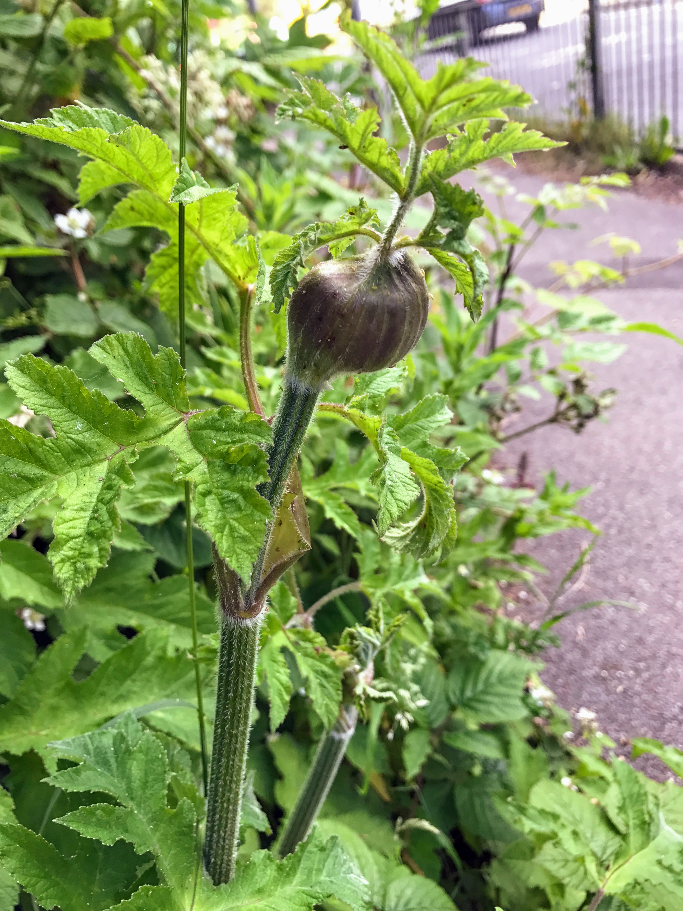
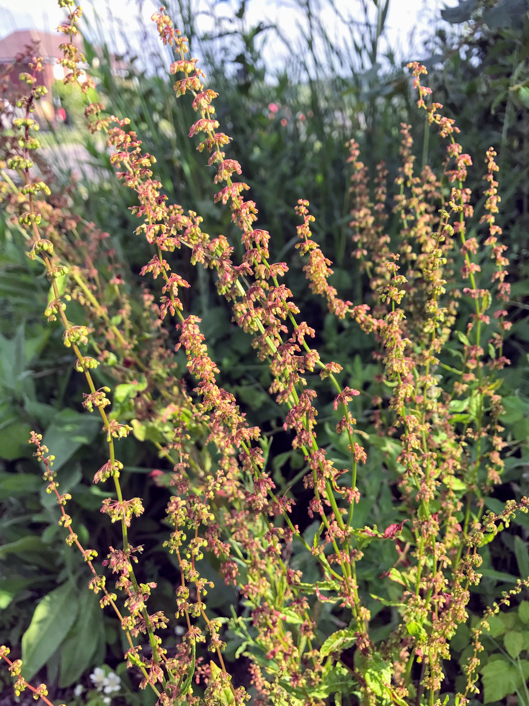
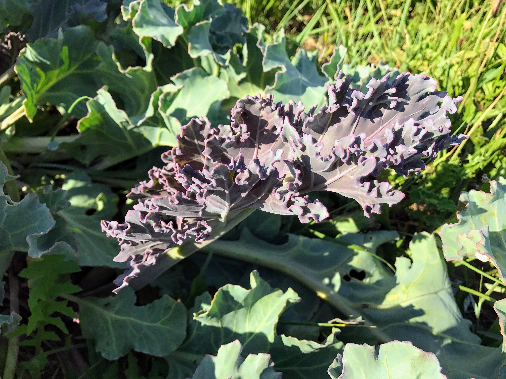

# Hogweed

This was actually found in Crawley, will replace with a Brighton specimen.

- [Heracleum sphondylium](https://en.wikipedia.org/wiki/Heracleum_sphondylium)

# Sisymbrium officinale

- [Sisymbrium officinale](https://en.wikipedia.org/wiki/Sisymbrium_officinale)
- [Brassica_nigra](https://en.wikipedia.org/wiki/Brassica_nigra) (compare)

# Parietaria judaica

See [Parietaria judaica](https://en.wikipedia.org/wiki/Parietaria_judaica).

# Erigeron canadensis

See [Erigeron canadensis](https://en.wikipedia.org/wiki/Erigeron_canadensis).

# Mentha arvensis

See [Mentha arvensis](https://en.wikipedia.org/wiki/Mentha_arvensis).

# Yellow-wort (Blackstonia perfoliata)

See [Blackstonia perfoliata](https://en.wikipedia.org/wiki/Blackstonia_perfoliata).

# Bramble

# Wild | Common | Marsh mallow

See [Malva_sylvestris](https://en.wikipedia.org/wiki/Malva_sylvestris).

# Bristly ox tongue

See [Helminthotheca echioides](https://en.wikipedia.org/wiki/Helminthotheca_echioides).

# Black horehound (Ballota nigra subsp. meridionalis)?

# Alder buckthorn | damson | bullace | sloe (too early)

# Elderflower

See [Sambucus](https://en.wikipedia.org/wiki/Sambucus).

# Alkanet

"In alkali environments the alkanet dye has a blue color, with the color
changing again to crimson on addition of an acid. The colour is red at pH
6.1, purple at 8.8 and blue at pH 10."

- [Alkanna tinctoria](https://en.wikipedia.org/wiki/Alkanna_tinctoria)
- [Pentaglottis sempervirens](https://en.wikipedia.org/wiki/Pentaglottis_sempervirens)

# Great willowherb

See [Epilobium hirsutum](https://en.wikipedia.org/wiki/Epilobium_hirsutum).

# Rumex sp.

There are so many species of [Rumex](https://en.wikipedia.org/wiki/Rumex).

Curled dock (Rumex crispus)? Rumex obtusifolius?

# Things I'd like to find

- Wood sorrel ([Oxalis](https://en.wikipedia.org/wiki/Oxalis))

# Sea kale

See 

