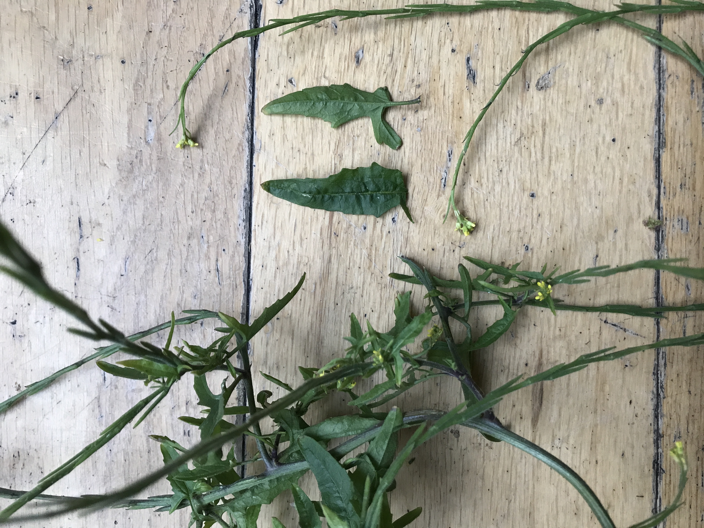
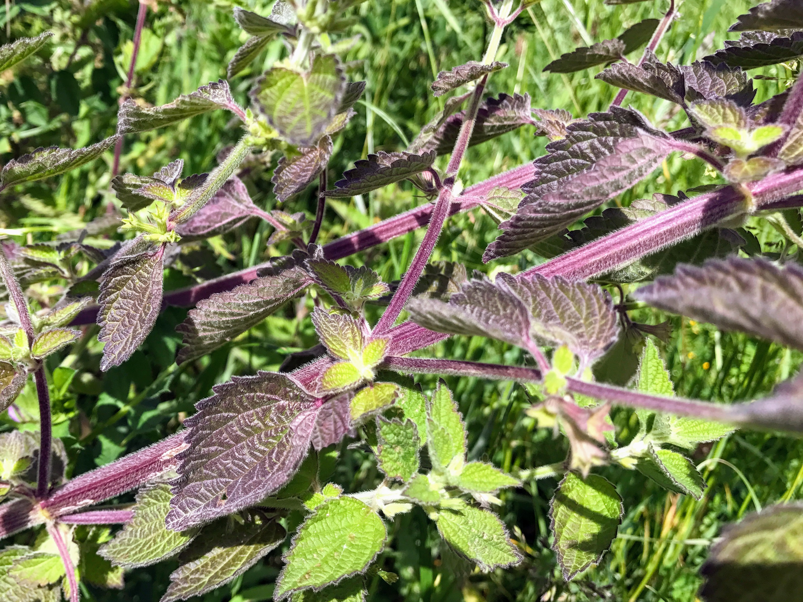

# Sisymbrium officinale

https://en.wikipedia.org/wiki/Sisymbrium_officinale

# Parietaria judaica

https://en.wikipedia.org/wiki/Parietaria_judaica

# Erigeron canadensis

https://en.wikipedia.org/wiki/Erigeron_canadensis

# IMG_2599

# IMG_2598

# IMG_2593

# IMG_2591

# IMG_2588

# IMG_2586

# IMG_2585

# IMG_2584

