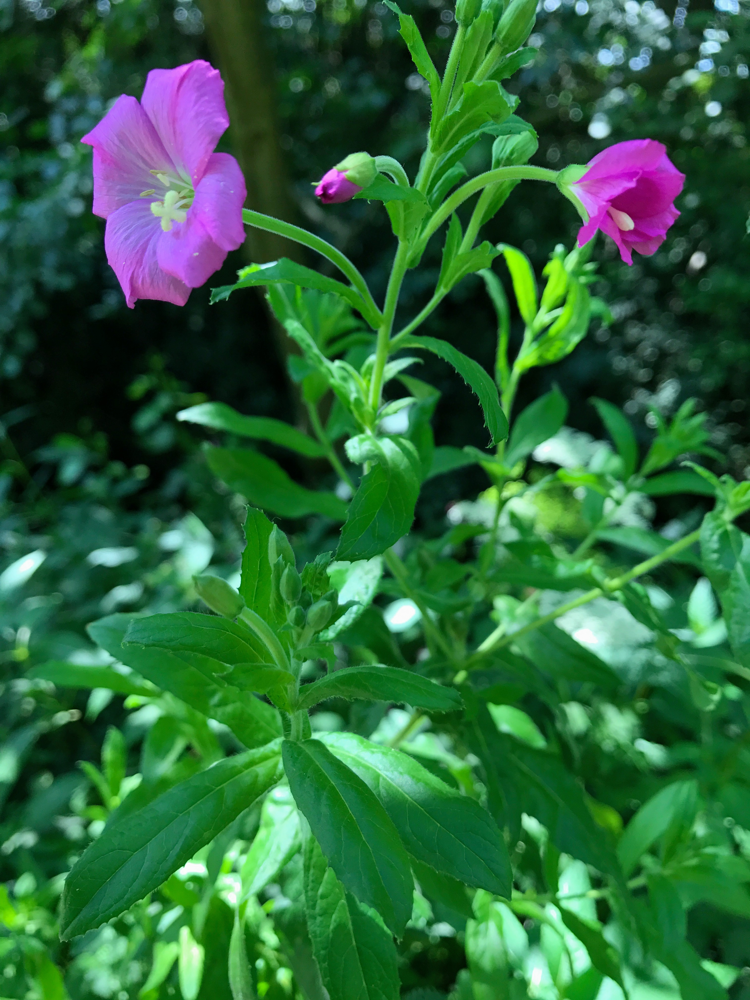

# Great willowherb

I thought it was sage at the time. Smelled pleasant but not of anything I could
place. Need some photos of the flowers. 

https://en.wikipedia.org/wiki/Epilobium_hirsutum

# Rosebay willowherb or fireweed

See [Chamaenerion angustifolium](https://en.wikipedia.org/wiki/Chamaenerion_angustifolium).

